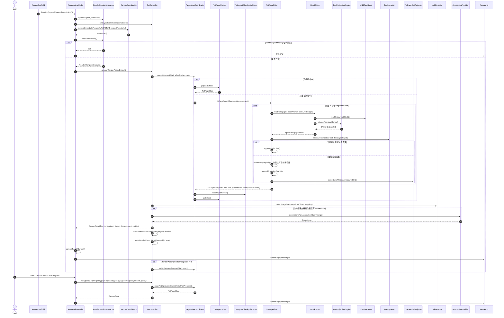
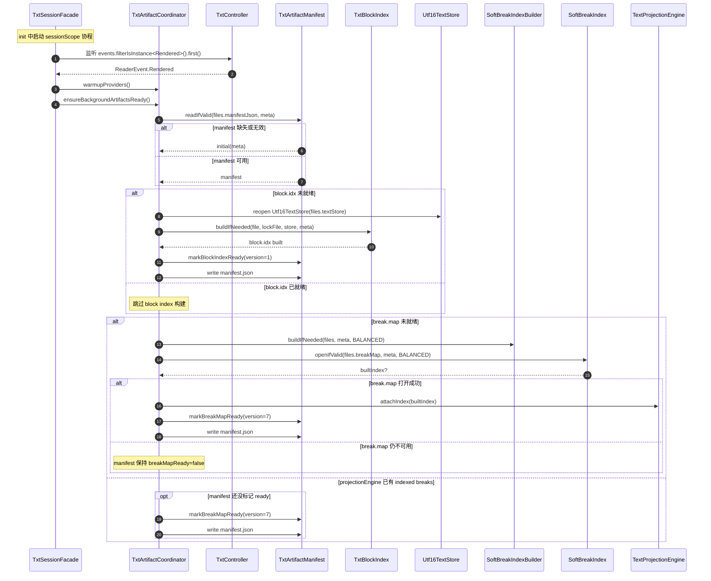
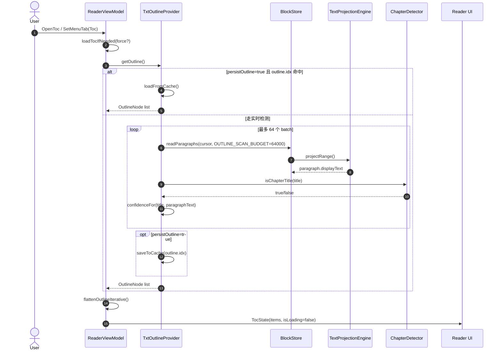
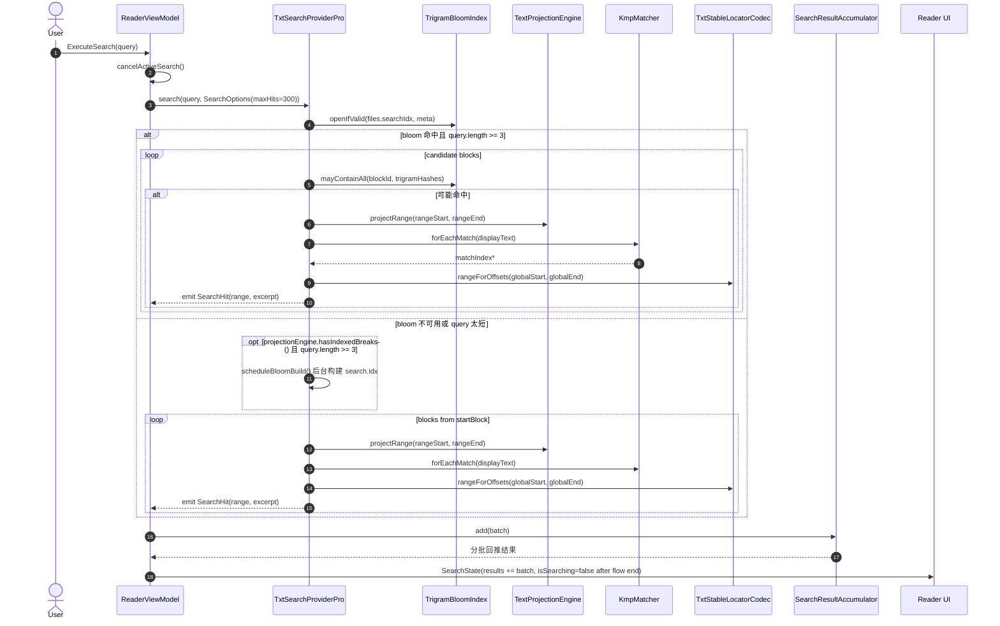
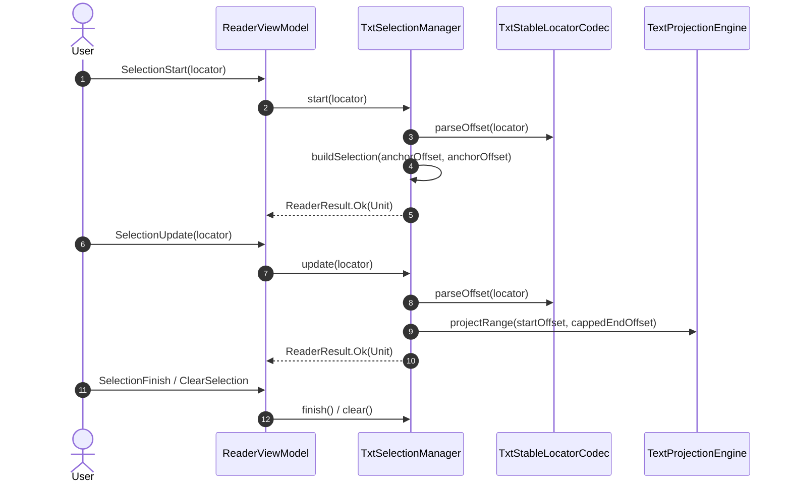
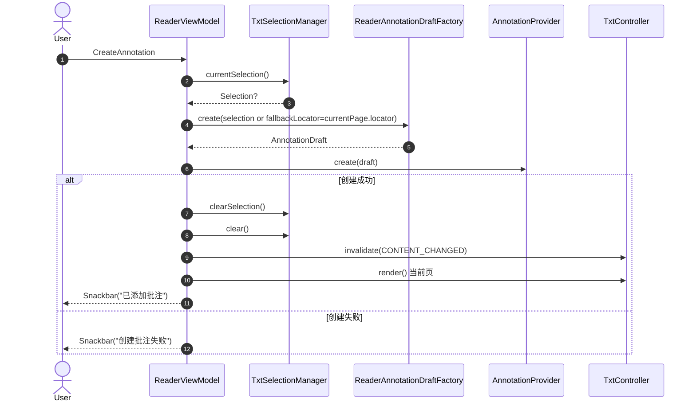
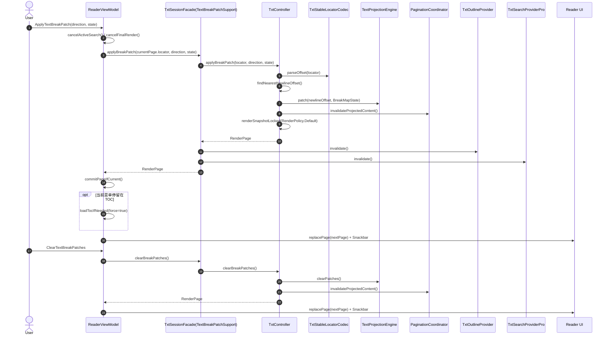

# TXT 阅读时序图

说明：
- 以下内容只依据实际源码梳理，未参考 `docs/` 下文档。
- 范围覆盖 `feature/reader` 打开阅读页、`core/reader/runtime` 分发到 TXT 引擎、`engines/txt` 的最小打开、会话创建、分页渲染、翻页、后台产物补齐、目录、搜索、选区、批注、换行修正。
- 2026-03-08 更新：`feature/reader` 里的会话前置条件与 collector 生命周期已收口到 `ReaderSessionInteractor`；TXT 会话已改为 `TxtSessionFacade + TxtArtifactCoordinator + TxtNavigationService + TxtPaginationService + TxtPageExtrasService`。

主要代码入口：
- `feature/reader/src/main/kotlin/com/ireader/feature/reader/ui/ReaderScreen.kt`
- `feature/reader/src/main/kotlin/com/ireader/feature/reader/presentation/ReaderViewModel.kt`
- `core/data/src/main/kotlin/com/ireader/core/data/reader/ReaderLaunchRepository.kt`
- `core/reader/runtime/src/main/kotlin/com/ireader/reader/runtime/DefaultReaderRuntime.kt`
- `engines/txt/src/main/kotlin/com/ireader/engines/txt/TxtEngine.kt`
- `engines/txt/src/main/kotlin/com/ireader/engines/txt/internal/open/TxtOpener.kt`
- `engines/txt/src/main/kotlin/com/ireader/engines/txt/internal/open/TxtDocument.kt`
- `engines/txt/src/main/kotlin/com/ireader/engines/txt/internal/session/TxtSessionFacade.kt`
- `engines/txt/src/main/kotlin/com/ireader/engines/txt/internal/artifact/TxtArtifactCoordinator.kt`
- `engines/txt/src/main/kotlin/com/ireader/engines/txt/internal/render/TxtController.kt`
- `engines/txt/src/main/kotlin/com/ireader/engines/txt/internal/render/PaginationCoordinator.kt`
- `engines/txt/src/main/kotlin/com/ireader/engines/txt/internal/render/TxtPageFitter.kt`

## 1. 打开 TXT 阅读会话

关键点：
- `ReaderScreen` 的 `Start`、`TextLayouterFactoryChanged`、`LayoutChanged` 是三条独立输入，现在由 `ReaderSessionInteractor` 统一维护会话、布局、排版器三者的前置条件。
- `TxtOpener.openMinimal()` 只保证 `text.store`、`meta.json`、`manifest.json` 足够打开阅读，会话可先建立，`block.idx` 和 `break.map` 可以稍后后台补齐。
- `ReaderLaunchRepository` 对 TXT 会直接使用 `reflowConfig.withReaderAppearance(displayPrefs)` 作为初始配置。

## 2. 首次渲染与翻页

关键点：
- `RenderCoordinator` 会把普通请求做 `24ms debounce`，立即请求走 `immediateRequests`。
- TXT 的 `document.capabilities.fixedLayout == false`，所以 `ReaderViewModel` 中仅对固定版式使用的 DRAFT/FINAL 二段渲染分支不会进入 TXT 主链路。
- `TxtController.next/prev` 仍要求 layouter 已绑定，但具体前置条件与 viewport 绑定缓存已经从 `ReaderViewModel` 下沉到 `ReaderSessionInteractor`。

## 3. 首次可见后后台补齐产物

关键点：
- 这条后台链路是在首个 `Rendered` 事件之后才启动，不阻塞首屏。
- 当前实现由 `TxtSessionFacade` 在首个 `Rendered` 后驱动 `TxtArtifactCoordinator`；搜索索引允许后台 warmup，目录仍保持按需构建。

## 4. 目录与搜索

### 4.1 目录加载

### 4.2 文内搜索

关键点：
- 搜索不是直接扫原始 `text.store`，而是先经过 `TextProjectionEngine.projectRange()`，因此搜索文本与页面显示文本保持一致。
- `TxtSearchProviderPro` 在 bloom index 不可用时会退化为全块扫描，不会阻塞功能可用性。

## 5. 选区、批注、换行修正

### 5.1 选区

### 5.2 创建批注

注：
- 当前实现会在批注创建成功后 `invalidate(CONTENT_CHANGED)`，并立即重绘当前页，确保 decoration 同步到 UI。

### 5.3 TXT 换行修正

关键点：
- 换行修正真正修改的是 `TextProjectionEngine` 的 patch 层，不会回写原始 `text.store`。
- 一旦 patch 变化，`TxtSessionFacade` 会通过 `TxtArtifactCoordinator` 让目录缓存和搜索缓存失效，因为章节识别与搜索都依赖投射后的显示文本。

## 6. 汇总

实际代码中的 TXT 阅读主链路可以概括为：

1. `ReaderScreen` 先后把 `Start`、`TextLayouterFactoryChanged`、`LayoutChanged` 送入 `ReaderViewModel`。
2. `ReaderViewModel.open()` 负责拿书、找源、恢复历史定位，并通过 `ReaderLaunchRepository -> DefaultReaderRuntime -> TxtEngine -> TxtOpener` 打开最小可读文档。
3. `TxtDocument.createSession()` 在会话阶段组装 `TxtController + TextProjectionEngine + BlockStore + TxtSessionFacade`。
4. `ReaderSessionInteractor` 等待会话、布局、排版器三者都准备好后，`RenderCoordinator` 才调用 `TxtController.render()`。
5. `TxtController` 现在把导航、分页后台任务、页面 links/decorations 拆给 `TxtNavigationService + TxtPaginationService + TxtPageExtrasService`，自身主要负责 controller API 与 `RenderPage` 组装。
6. 首个 `Rendered` 事件之后，`TxtSessionFacade` 通过 `TxtArtifactCoordinator` 后台补齐 `block.idx` 与 `break.map`，后续目录、搜索、换行修正、选区都建立在这些产物和 `TextProjectionEngine` 的投射能力之上。
