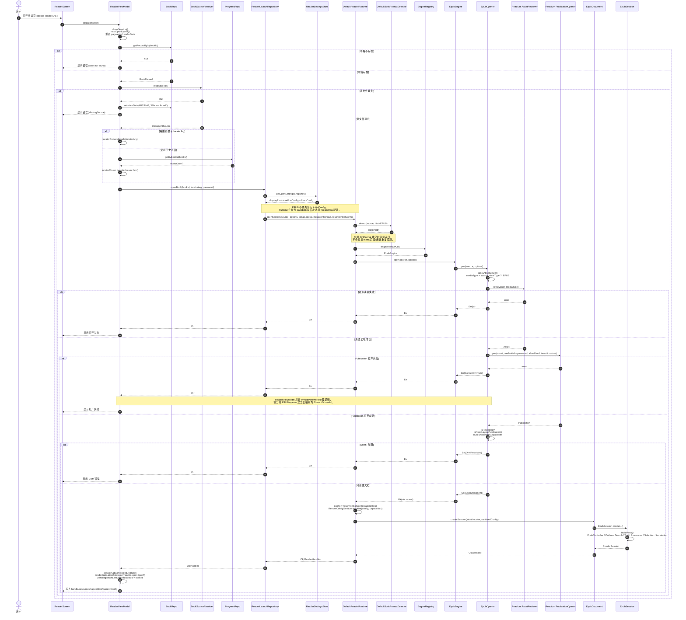
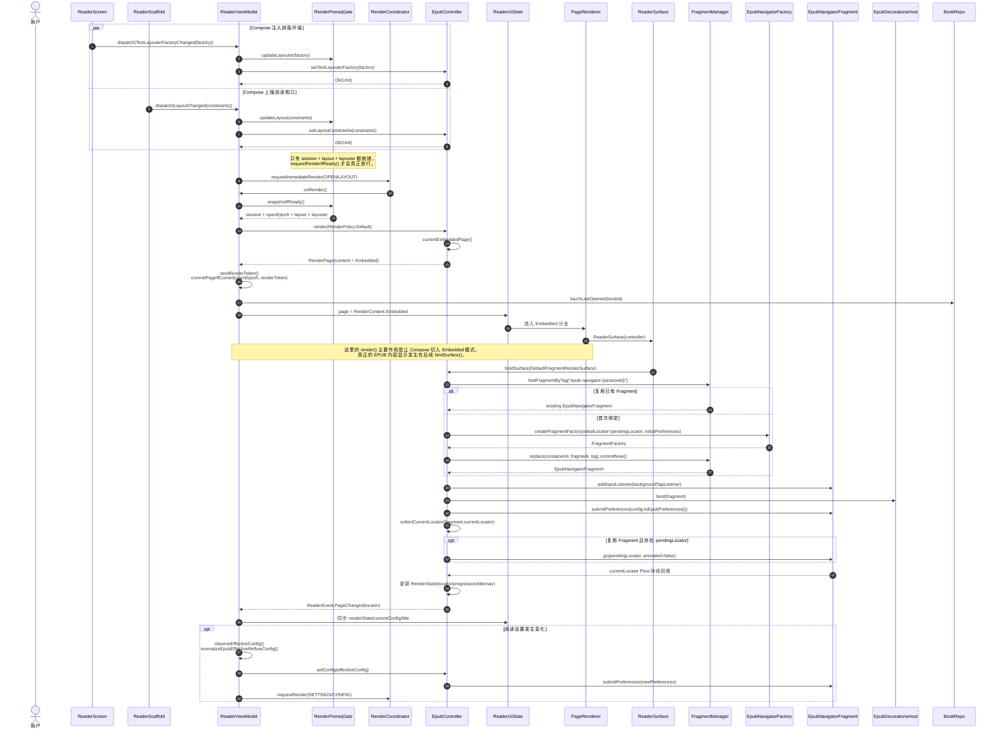
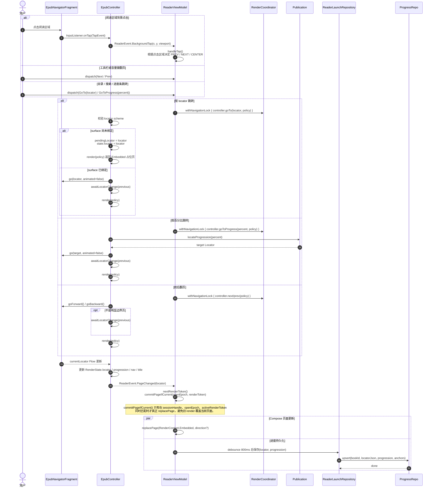
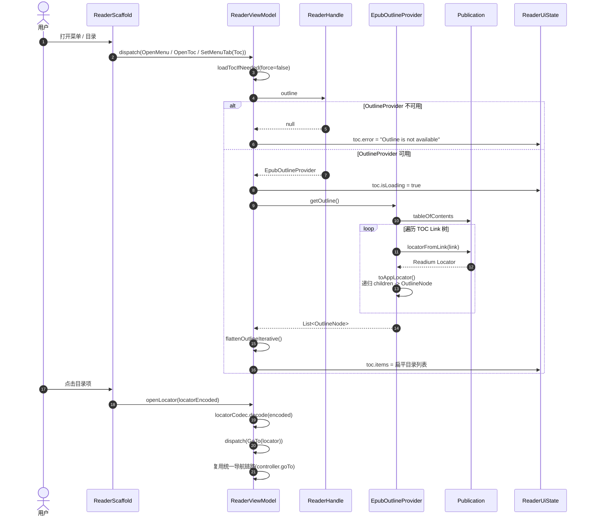
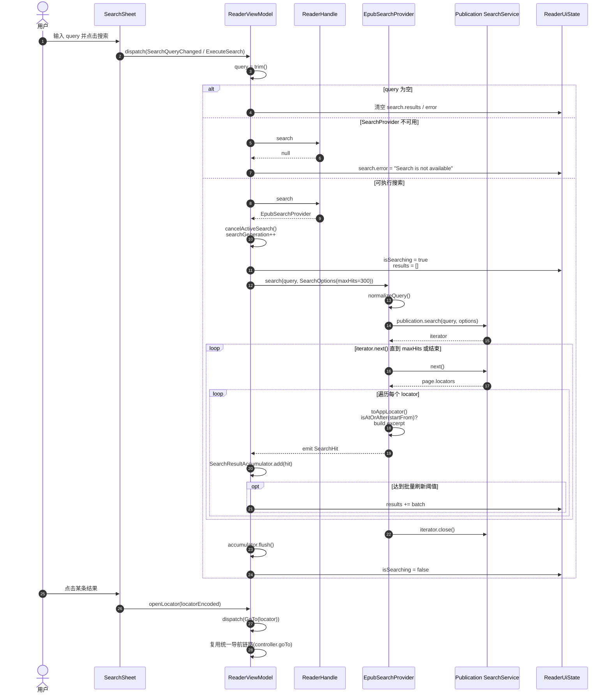
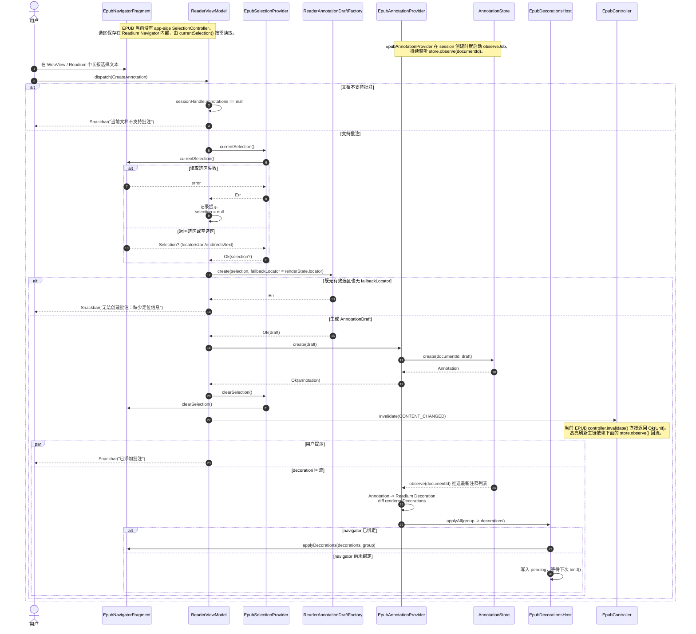
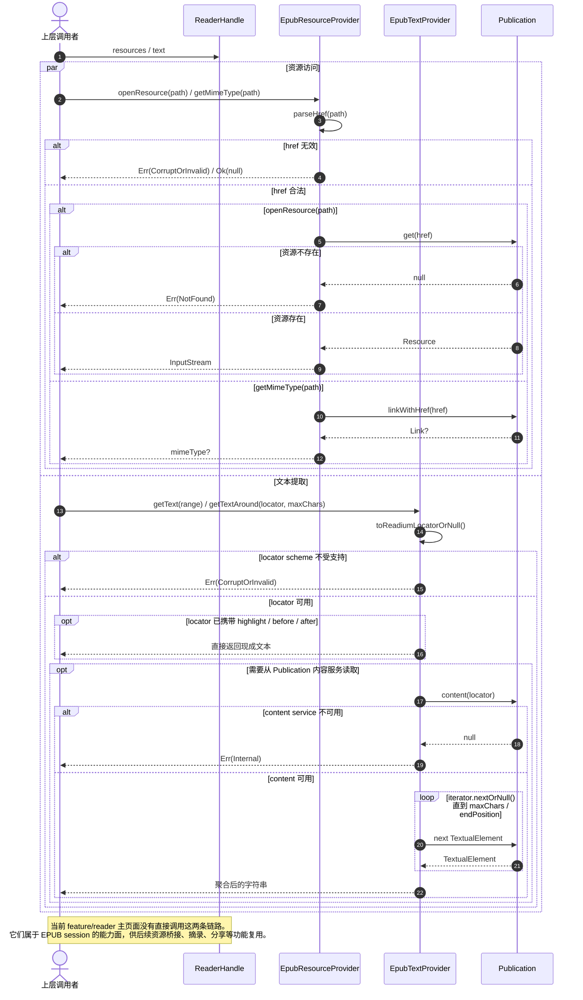

# EPUB 阅读时序图

本文基于当前仓库中已经落地的 EPUB 阅读实现整理，覆盖 `feature/reader`、`core/reader/runtime`、`engines/epub` 三层在“阅读期”的真实调用链。

## 文档边界

- 只覆盖阅读期链路，不包含导入、索引、书架扫描。
- 只画仓库内已经验证过的调用路径，不补推测性的后台任务。
- EPUB 当前使用 Readium Navigator 作为嵌入式阅读内核，Compose 层拿到的是 `RenderContent.Embedded`，不是 HTML 页面快照。

## 关键代码锚点

- `feature/reader/src/main/kotlin/com/ireader/feature/reader/ui/ReaderScreen.kt`
- `feature/reader/src/main/kotlin/com/ireader/feature/reader/presentation/ReaderViewModel.kt`
- `core/data/src/main/kotlin/com/ireader/core/data/reader/ReaderLaunchRepository.kt`
- `core/reader/runtime/src/main/kotlin/com/ireader/reader/runtime/DefaultReaderRuntime.kt`
- `engines/epub/src/main/kotlin/com/ireader/engines/epub/internal/open/EpubOpener.kt`
- `engines/epub/src/main/kotlin/com/ireader/engines/epub/internal/controller/EpubController.kt`
- `engines/epub/src/main/kotlin/com/ireader/engines/epub/internal/session/EpubSession.kt`

## 1. 打开阅读页到首屏可读

这一段描述从 `ReaderScreen` 进入阅读页，到 `ReaderViewModel` 拿到 `ReaderHandle` 的完整打开链路。

几个关键事实：

- 当前书籍格式会作为 `hintFormat` 直接传给 `DefaultBookFormatDetector`，对于书架内已知 EPUB 不会再做内容 sniff。
- EPUB 不会像 TXT 那样提前构造 `initialConfig`，而是在 `DefaultReaderRuntime.openSession()` 内根据 `DocumentCapabilities` 决定是 `fixedConfig` 还是 `reflowConfig`。
- `EpubSession.create()` 同时组装 controller 和各类 provider，后续目录、搜索、文本、资源、批注都从同一个 `ReaderHandle` 暴露出去。

## 2. 渲染前置条件与嵌入式绑定

EPUB 的首屏不是一次“把页面渲染成位图/文本页”就结束。当前实现先通过一次 `render()` 产出 `RenderContent.Embedded`，让 Compose 切换到 `ReaderSurface`，再由 `bindSurface()` 把 Readium `EpubNavigatorFragment` 真正挂上去。

几个关键事实：

- `RenderPrereqGate` 只在 `session + layout + layouter` 同时齐备时才允许触发渲染。
- `setTextLayouterFactory()` 对 EPUB 当前是 no-op，但它仍参与统一的渲染门槛判断。
- `setLayoutConstraints()` 对 EPUB 的主要价值是点击视口和承载面尺寸同步，而不是像 TXT 那样直接影响排版分页。

补充说明：

- `ReaderSurface` 只有在宿主 `Activity` 是 `FragmentActivity` 时才能绑定 EPUB 导航器，否则只会显示“不支持 EPUB 导航器渲染”文本。
- `ReaderSurface` 销毁时会调用 `controller.unbindSurface()`；当前 `EpubController` 会把当前位置写回 `pendingLocator`，然后解除 decoration 绑定并移除 fragment。
- `ReaderViewModel.closeSession()` 最终会经由 `SessionCoordinator.closeCurrent()` 保存当前进度，再关闭 `ReaderHandle -> ReaderSession -> ReaderDocument`。

## 3. 翻页、跳转与进度保存

这一段描述阅读期最频繁的导航链路，包括点击翻页区、显式 `Next/Prev`、按进度跳转、按 locator 跳转，以及进度持久化。

几个关键事实：

- EPUB 的实际翻页动作是 `EpubNavigatorFragment.goForward()/goBackward()/go()`。
- `ReaderViewModel` 用 `openEpoch + activeRenderToken` 保护页面提交，避免旧 render 结果覆盖当前会话。
- 进度保存不是每次立即写库，而是从 `controller.state` 取 `locator + progression` 后做 800ms debounce。

补充说明：

- `handleTap()` 还会处理防误触区域、中心区显示/隐藏 chrome、翻页后短时间内中心点击撤销等交互；这些都发生在 `ReaderViewModel` 内部，真正触发翻页时才进入上图中的 `controller.next/prev()`。
- `prefetchNeighbors()` 在当前 `EpubController` 中是 no-op，因此 EPUB 现在没有额外的邻页预热链路。

## 4. 目录加载与目录跳转

目录不是在打开会话时预热出来的，而是在用户真正打开目录面板后懒加载。

几个关键事实：

- `ReaderViewModel.loadTocIfNeeded()` 会先检查 `sessionHandle.outline` 是否存在。
- `EpubOutlineProvider` 直接读取 `Publication.tableOfContents`，再把 `Link` 递归映射成应用侧 `OutlineNode`。
- 目录点击后不会走特殊捷径，而是重新回到统一的 `openLocator() -> GoTo(locator)` 导航链。

补充说明：

- 当 `force = false` 且当前 `toc.items` 已有内容时，`loadTocIfNeeded()` 会直接返回，不重复请求 `OutlineProvider`。
- 目录项在 UI 层会额外保留 `href / position / progression / confidence` 等字段，来源于 locator extras。

## 5. 全文搜索与结果跳转

搜索链路使用 `Flow<SearchHit>` 增量返回结果，`ReaderViewModel` 再用 `SearchResultAccumulator` 做小批量 UI 合并。

几个关键事实：

- 当前 EPUB 搜索能力来自 Readium `Publication.search()`。
- 结果上限由 `ReaderViewModel.executeSearch()` 固定为 `maxHits = 300`。
- 点击搜索结果后，仍然回到统一的 `openLocator() -> GoTo(locator)` 跳转链。

补充说明：

- ViewModel 实际收集的是 `provider.search(...).asReaderResult()`，因此搜索迭代过程中的 provider 异常会被转成 `ReaderResult.Err` 并映射到 `search.error`。
- 重新发起搜索时，旧搜索会先经过 `cancelActiveSearch()` 取消，再递增 `searchGeneration`；后续只有 generation 匹配的结果允许写回 UI。

## 6. 选区、批注与装饰同步

EPUB 批注的关键点不在 `SelectionController`，而在于 Readium Navigator 内部选区 + `AnnotationStore.observe()` 回流后的 decoration 同步。

几个关键事实：

- EPUB 当前没有 app-side `SelectionController`；`ReaderViewModel.SelectionStart/Update/Finish` 这套入口主要服务 TXT/PDF，EPUB 批注是通过 `selection.currentSelection()` 按需读取现有选区。
- `ReaderViewModel.createAnnotation()` 会优先用真实选区生成 `LocatorRange`，拿不到选区时才回退到当前页面 locator。
- 批注高亮的真正刷新主链是 `AnnotationStore.observe() -> EpubAnnotationProvider -> EpubDecorationsHost -> EpubNavigatorFragment.applyDecorations()`。

补充说明：

- `ReaderAnnotationDraftFactory` 对 EPUB 最常见的输出是 `AnnotationAnchor.ReflowRange`。
- 如果 `selectedText` 可用，批注默认内容会带上当前选中文字；否则只写锚点，不强制带正文内容。

## 7. 资源访问与文本提取能力

这部分不是当前阅读主页面的显式主链，但它们已经随 `ReaderHandle` 就绪，后续任何需要直接读取 EPUB 资源或抽取正文片段的功能都要经过这里。

几个关键事实：

- `EpubResourceProvider` 处理的是应用层显式资源访问，不等同于 Readium Navigator 内部自己的资源解析过程。
- `EpubTextProvider` 优先复用 locator 自带的高亮/上下文文本，取不到时再回退到 `Publication.content()`。

## 实现事实与边界

- EPUB 当前使用 `Readium EpubNavigatorFragment` 作为最终显示层；Compose 负责壳层状态、手势转发、菜单与面板。
- `render()` 对 EPUB 返回的是 `RenderContent.Embedded` 占位页，不是排版后的位图或文本页。
- `setTextLayouterFactory()`、`setLayoutConstraints()` 仍然经过统一渲染门槛，但 EPUB 当前对它们的使用重点分别是接口对齐和视口信息同步。
- `prefetchNeighbors()`、`invalidate()` 在当前 `EpubController` 中都没有实质性的渲染工作；其中批注高亮刷新主要依靠 `EpubDecorationsHost`。
- 阅读设置变化会先经过 `ReaderViewModel.normalizeEpubEffectiveReflowConfig()`，再被映射成 `EpubPreferences` 提交给 Readium。
- `ReaderSurface` 卸载时会触发 `unbindSurface()`，`EpubController` 会把当前位置存回 `pendingLocator`，为下一次重绑恢复位置。
- `ReaderViewModel` 虽然具备密码弹窗分支，但当前 `EpubOpener` 并没有把 Readium 打开失败细分为 `ReaderError.InvalidPassword`。
- 导航器内部超链接在当前仓库里没有经过 `ReaderIntent.ActivateLink` 这条显式 feature 层桥接，因此本文只覆盖已经在代码中验证过的 EPUB 导航入口。
