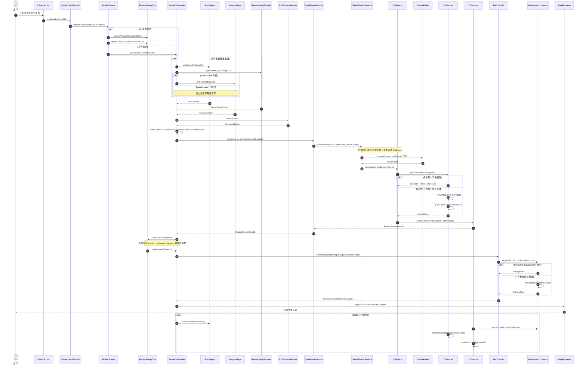
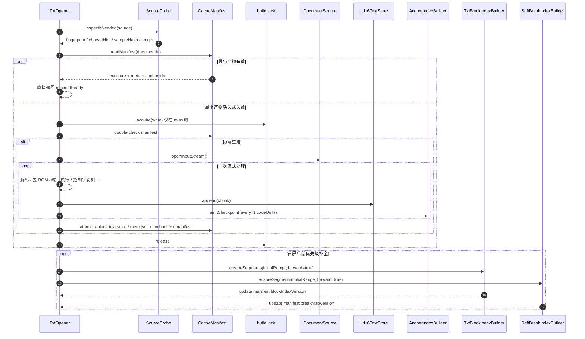
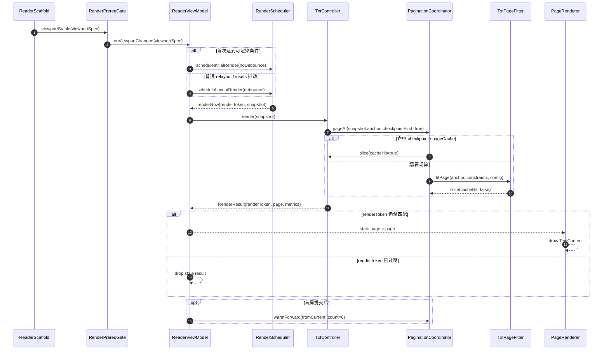

我看完你的现稿后，核心判断是：

这套链路本身方向没错，问题主要不在“少了步骤”，而在于**把首屏必需路径、可延后预处理、后台预热**混在了一条链路里。真正该优化的是这三件事：

1. 把打开过程拆成 **最小可读打开 → 首屏渲染闸门 → 首屏后补全**。
2. 把 `ReaderViewModel` 的启动从“多个事件互相撞”改成“**单一渲染门槛收口**”。
3. 把 `TxtOpener` 从“全量预处理后才能读”改成“**最小产物先返回，重活后台补**”。

---

## 先说我建议你立刻修的 8 个点

### 1. `initialLocator` 文档要统一，不要一会儿写 `0`，一会儿写 `null`

你现在上面写的是：

* `路由 locator > 历史 locator > 0`

但图里又写：

* `routeLocator ?: historyLocator ?: null`

这会让实现和文档都变得模糊。
建议统一成一个抽象语义：

```text
initialLocator = routeLocator ?: historyLocator ?: StartLocator
```

至于 `StartLocator` 在 engine 内最终映射成 `0` 还是 `null`，留给实现层处理，时序图里不要混写两种语义。

---

### 2. 在“书架已有 TXT 书”这个场景里，`BookFormatDetector` 不该再走完整检测主路径

你限定的范围已经非常明确：

* 书已在书架中
* 用户从书架点击一本 TXT 书进入阅读页

这时 `book.format` 已经是可信 hint 了。
优化建议是：

* 优先直接 `engineFor(TXT)`
* `Detector` 仅做 fallback / 校验
* 不要为了确认 TXT 再多开一轮 source sniff

这能直接减少一次 I/O 和一次链路分叉。

---

### 3. `Settings` 现在读了两次，应该合并成一次 `ReaderOpenConfig`

你现在的链路里：

* `OpenReaderSession` 先 `getDisplayPrefs()`
* `Runtime` 再 `getReflowConfig().withReaderAppearance(displayPrefs)`

这相当于把“打开阅读器所需配置”拆成了两段。

建议合并成一次读取：

```text
ReaderOpenConfig = displayPrefs + reflowConfig + paginationAffectingParams
```

这样 `OpenReaderSession` 只把一个完整配置往下传，减少 DataStore 读、减少组装逻辑分散。

---

### 4. `Layout` 不要在 VM 和 `RenderCoordinator` 两边各存一份

你现在的图里有这个味道：

* `Scaffold -> VM: LayoutChanged(constraints)`
* 打开成功后又 `VM -> Render: currentLayout()`

这说明布局状态有两个 owner：

* VM 知道一次
* RenderCoordinator 又存一次

建议改成：

* **VM / RenderPrereqGate 作为唯一 owner**
* `RenderCoordinator` 只负责“调度 render”，不负责“保管 layout”

否则很容易出现：

* 旧 layout 还没清
* 新 session 进来了
* `currentLayout()` 取到的是上一次值
* 触发一次无意义 render

---

### 5. 首次渲染不要经过 debounce

你现在写的是：

* `renderCurrentPageImmediate()`
* “经过 debounce 后执行”

这对首屏是很伤的。
建议明确分成两类调度：

* **Initial render**：不 debounce，直接执行
* **Relayout / Insets 抖动 / 工具栏动画**：再 debounce

首屏最怕的不是算一次，而是被“为了稳定 UI”平白拖一拍。

---

### 6. `TxtOpener` 的缓存复用条件太“全-or-无”了

当前图里是：

* `tryLoadCached(meta.json, text.store, block.idx, break.map)`
* 要么命中，要么全量重建

这会让 `block.idx` / `break.map` 绑死在首屏路径上。
建议拆成**分层产物**：

* **L0 最小层**：`text.store + meta`
* **L1 快速定位层**：`anchor.idx`（或轻量分段 seek index）
* **L2 完整分页层**：`block.idx + break.map`

首屏只依赖 L0/L1，L2 可以首屏后补建。

---

### 7. `persistOutline = false` 时，目录预热基本没有 ROI

你已经写明了：

* `persistPagination = true`
* `persistOutline = false`

那就意味着：

* **分页 checkpoint 预热有价值**
* **outline 预热不会落盘**

既然目录预热不落盘，又不在首屏路径里，那最合理的做法是：

* 从 open path 移出去
* 甚至直接改成“打开目录面板时懒加载”

这比在 `TxtSession.init warmup()` 里做更合适。

---

### 8. 所有异步 render 结果都要带 `openEpoch/sessionId/renderToken`

你现在的链路里，`open`、`layout`、`factory changed`、`render` 都可能交错。
如果没有版本号保护，非常容易出现：

* A 书打开中
* B 书又打开了
* A 的 render 结果晚到
* 结果把 B 的页面盖掉

建议每次打开都递增 `openEpoch`，每次 render 都发 `renderToken`，apply 页面时只认当前 token。

---

## 我建议你把方案改成“三段式”

### 第一段：最小可读打开

目标只有一个：**尽快得到可读第一页**

这段只做这些事：

* 取 `BookRecord`
* 解析 `DocumentSource`
* 取 `routeLocator / historyLocator`
* 读取一次 `ReaderOpenConfig`
* 使用可信 `hintFormat=TXT` 直达 `TxtEngine`
* `TxtOpener.openMinimal()` 返回首屏必需产物
* `TxtDocument.createSession(initialLocator, config)`

这里最重要的是一句：

> **首屏不应该等 `block.idx`、全量 `break.map`、search preheat、outline warmup`。**

---

### 第二段：首屏渲染闸门

你原来的规则是对的：

* active session
* TextLayouterFactory
* LayoutConstraints

但实现方式应该从“多个 action + 多处判断”改成“**一个 gate**”。

我建议门槛变成：

```text
session + viewportSpec + layouterKey/factory + paginationSignature
```

这里有两个关键细节：

1. `LayoutConstraints` 最好升级成 `ViewportSpec`
   不只是宽高，还要把影响分页的 padding / density / fontScale 也收进去。

2. `TextLayouterFactoryChanged(factory)` 不要按对象 identity 频繁发
   应该带一个 `layouterKey`，只有排版环境真的变了才触发。

---

### 第三段：首屏后补全

首屏出来以后，再做这些：

* `touchLastOpened(bookId)`
* `warmForward / prefetchAround`
* 补建或修复 `block.idx`
* 按需扩展 `break.map`
* search index preheat（低优先级）
* annotations / links / decorations overlay（能拆就拆）

---

## 建议你在文档里明确区分“阻塞首屏”和“不阻塞首屏”

### 阻塞首屏的事情

* Book/source/config/locator 的最小准备
* `TxtOpener.openMinimal()`
* `createSession()`
* 等待 `session + viewport + layouter`
* `checkpointFirst pageAt()`
* 首屏 page render

### 不阻塞首屏的事情

* `touchLastOpened`
* 全量 `block.idx`
* 全量 `break.map`
* search preheat
* outline warmup
* decorations / linkify / 非核心 overlay

这一步写清楚了，你整份方案就会立刻干净很多。

---

# 我给你一版可直接替换的 Mermaid 时序图

## 1）优化后的端到端总时序图



---

## 2）优化后的 `TxtOpener` 分阶段时序图



---

## 3）优化后的首屏分页与渲染时序图



---

# 我建议你在代码里这样落地

## `ReaderScreen.kt`

把现在这两个输入：

* `TextLayouterFactoryChanged(factory)`
* `LayoutChanged(constraints)`

改成更稳定的两个事件：

* `LayouterEnvChanged(layouterKey, factory)`
* `ViewportChanged(viewportSpec)`

重点不是换名字，而是：

* 只在 key 真变时发
* 不要每次重组都把 factory 再 dispatch 一遍

---

## `ReaderViewModel.kt`

这里是这轮优化的核心落点。

建议加四个东西：

1. `openEpoch`
2. `renderToken`
3. `RenderPrereqGate`
4. `Initial render bypass debounce`

同时把 `Layout` 的 owner 收口到 VM / Gate，`RenderCoordinator` 只做调度。

另外，`open()` 不要把所有 collector/warmup 都立刻拉起来，建议分成：

* session attach
* initial render
* first page committed
* background warmups

---

## `DefaultReaderRuntime.kt`

建议改成：

* 优先信任 `hintFormat=TXT`
* `SourceProbe` 只做一遍，供 runtime + opener 复用
* `ReaderOpenConfig` 一次读取后一路往下传

这样可以把“格式探测”和“采样、哈希、编码探测”里重复的 I/O 拿掉。

---

## `TxtOpener.kt`

这里建议直接拆两个入口：

* `openMinimal(...)`
* `ensureArtifactsAsync(...)`

再把缓存校验改成 manifest 分层：

* `storeVersion`
* `anchorIndexVersion`
* `blockIndexVersion`
* `breakMapVersion`
* `normalizerVersion`
* `fingerprint`

还有一个容易被忽略的点：

> 如果当前 `documentId` / `SourceDocumentIds.fromSourceSha256(...)` 需要在打开前先全量算 hash，建议改成“probe fingerprint + streaming digest”。

否则你可能会在真正解码前，先白白多读一遍全文件。

---

## `TxtSession.kt`

`init warmup()` 不要再放 search / outline 的重活了。

建议改成：

* session 创建时只做轻量 provider 装配
* `onFirstPageCommitted()` 后再启动低优先级任务

尤其是 `persistOutline = false` 的前提下，目录预热完全不应该卡在打开链路里。

---

## `PaginationCoordinator.kt`

这里最值得加两件事：

1. `checkpointFirst=true`
2. `ensureIndexed(range)`

也就是：

* 先看 pagination checkpoint 能不能直接缩短首屏拟合
* checkpoint 没命中，再只补当前页附近的 index / break info
* 不要把“整书分页辅助结构完备”当作首屏前置条件

另外，`layoutHash` 最好升级成 `PaginationSignature`，并且只包含真正影响分页的字段，不要把 theme color、toolbar state 这类不影响分页的东西也混进去。

---

## `TxtPageFitter.kt`

这里建议支持一种 fallback：

* 当 `block.idx` / `break.map` 还没补齐时
* 基于 `anchor.idx` 或局部扫描
* 只拟合当前页附近文本

这样首屏就不必等完整 index。

---

## `TxtController.kt`

建议让这些操作串行化：

* `setLayoutConstraints`
* `setTextLayouterFactory`
* `render`
* `warmForward`
* `prefetchAround`

最稳的方式是 session 内部 actor / 单线程串行调度。
这样 `layout changed` 和 `render` 就不会在不同协程里互相打架。

---

# 这轮改造，最划算的实施顺序

## 第一轮：低风险、高收益，不改磁盘格式也能做

先做这几件：

* 统一 `StartLocator` 语义
* route locator 存在时，不等待历史进度
* `ReaderOpenConfig` 合并读取
* 可信 TXT 场景下直达 `TxtEngine`
* 首次 render 不 debounce
* `openEpoch/renderToken` 防 stale
* `touchLastOpened/search warmup/outline warmup` 全部移出首屏路径
* `checkpointFirst` 成为默认快路径

这一轮不用大改缓存格式，收益已经很明显。

---

## 第二轮：中等改造，但对 TTFR 改善最大

再上这些：

* `openMinimal()`
* `anchor.idx`
* `block.idx / break.map` 分层与分段
* manifest 独立版本化
* `ensureIndexed(range)` + 局部分页 fallback

这一轮做完，你的 TXT 首屏链路就会从“全量预处理式”变成真正的“按需打开式”。

---

# 对你现在这份 Project Root 的建议

你的根目录设计整体是合理的，这轮优化**不建议新增顶级 module**。
先在现有模块里补这几个 package 就够了：

* `core/reader/runtime/open/`

    * `ReaderOpenConfig`
    * `ReaderConfigProvider`
    * `SourceProbe`

* `engines/engine-common/reflow/`

    * `ViewportSpec`
    * `LayouterKey`
    * `PaginationSignature`

* `engines/txt/internal/cache/`

    * `TxtArtifactManifest`
    * `AnchorIndexBuilder`
    * `BlockIndexBuilder`
    * `BreakIndexBuilder`

也就是说，这次更像是**包级收口**，不是模块级重构。

---

# 最后给你一个简洁版结论

你的方案最该从“串行全做完再显示”改成：

> **最小打开拿到 `text.store` 和可 seek 的轻量 index → 等 session/viewport/layouter 三件套齐了立刻首屏 render → 其余 index 和 warmup 首屏后补。**

对现在这条链路，收益最大的两刀是：

1. **`TxtOpener` 分层：`openMinimal()` + 后台补全**
2. **`ReaderViewModel` 改成单一 render gate，首次 render 不 debounce**

下一步最值得先改的是 `ReaderViewModel.open()/render gate` 和 `TxtOpener`，这两处同时能把文档、时序图和真实 TTFR 一起拉顺。
